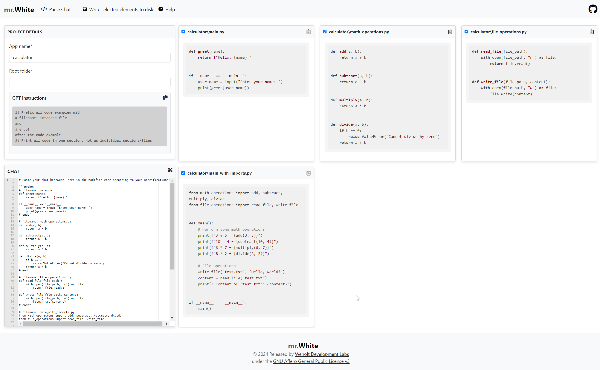

# Django Mr. White


Reusable django app that will parses responses from ChatGPT and write the content to corresponding files.

Tested with:

* Python version 3.12.2
* Django version 5.0.2

Licensed under GNU AFFERO GENERAL PUBLIC LICENSE Version 3.



## Installation

Clone main repository:

```bash

    $ git clone https://github.com/weholt/django-mrw.git
    $ cd django-mrw
    $ pip install -e .
```
Or

``` bash

    $ pip install git+https://github.com/weholt/django-mrw.git

```

    